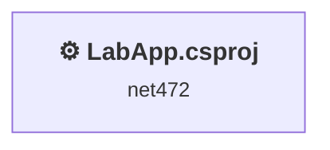
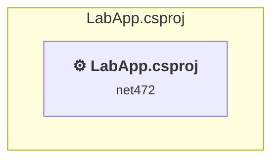

# Projects and dependencies analysis

This document provides a comprehensive overview of the projects and their dependencies in the context of upgrading to .NETCoreApp,Version=v10.0.

## Table of Contents

- [Executive Summary](#executive-Summary)
  - [Highlevel Metrics](#highlevel-metrics)
  - [Projects Compatibility](#projects-compatibility)
  - [Package Compatibility](#package-compatibility)
  - [API Compatibility](#api-compatibility)
- [Aggregate NuGet packages details](#aggregate-nuget-packages-details)
- [Top API Migration Challenges](#top-api-migration-challenges)
  - [Technologies and Features](#technologies-and-features)
  - [Most Frequent API Issues](#most-frequent-api-issues)
- [Projects Relationship Graph](#projects-relationship-graph)
- [Project Details](#project-details)

  - [LabApp\LabApp.csproj](#labapplabappcsproj)

## Executive Summary

### Highlevel Metrics

| Metric | Count | Status |
| :--- | :---: | :--- |
| Total Projects | 1 | All require upgrade |
| Total NuGet Packages | 16 | 6 need upgrade |
| Total Code Files | 47 |  |
| Total Code Files with Incidents | 32 |  |
| Total Lines of Code | 4670 |  |
| Total Number of Issues | 4664 |  |
| Estimated LOC to modify | 4648+ | at least 99,5% of codebase |

### Projects Compatibility

| Project | Target Framework | Difficulty | Package Issues | API Issues | Est. LOC Impact | Description |
| :--- | :---: | :---: | :---: | :---: | :---: | :--- |
| [LabApp\LabApp.csproj](#labapplabappcsproj) | net472 | 🟡 Medium | 14 | 4648 | 4648+ | ClassicWinForms, Sdk Style = False |

### Package Compatibility

| Status | Count | Percentage |
| :--- | :---: | :---: |
| ✅ Compatible | 10 | 62,5% |
| ⚠️ Incompatible | 0 | 0,0% |
| 🔄 Upgrade Recommended | 6 | 37,5% |
| ***Total NuGet Packages*** | ***16*** | ***100%*** |

### API Compatibility

| Category | Count | Impact |
| :--- | :---: | :--- |
| 🔴 Binary Incompatible | 4116 | High - Require code changes |
| 🟡 Source Incompatible | 532 | Medium - Needs re-compilation and potential conflicting API error fixing |
| 🔵 Behavioral change | 0 | Low - Behavioral changes that may require testing at runtime |
| ✅ Compatible | 3452 |  |
| ***Total APIs Analyzed*** | ***8100*** |  |

## Aggregate NuGet packages details

| Package | Current Version | Suggested Version | Projects | Description |
| :--- | :---: | :---: | :--- | :--- |
| Emgu.CV | 4.8.1.5350 |  | [LabApp.csproj](#labapplabappcsproj) | ✅Compatible |
| Emgu.CV.Bitmap | 4.8.1.5350 |  | [LabApp.csproj](#labapplabappcsproj) | ✅Compatible |
| Microsoft.Bcl.AsyncInterfaces | 9.0.0 | 10.0.8 | [LabApp.csproj](#labapplabappcsproj) | NuGet package upgrade is recommended |
| System.Buffers | 4.5.1 |  | [LabApp.csproj](#labapplabappcsproj) | NuGet package functionality is included with framework reference |
| System.Drawing.Common | 9.0.0 | 10.0.8 | [LabApp.csproj](#labapplabappcsproj) | NuGet package upgrade is recommended |
| System.Drawing.Primitives | 4.3.0 |  | [LabApp.csproj](#labapplabappcsproj) | NuGet package functionality is included with framework reference |
| System.IO.Pipelines | 9.0.0 | 10.0.8 | [LabApp.csproj](#labapplabappcsproj) | NuGet package upgrade is recommended |
| System.Memory | 4.5.5 |  | [LabApp.csproj](#labapplabappcsproj) | NuGet package functionality is included with framework reference |
| System.Numerics.Vectors | 4.5.0 |  | [LabApp.csproj](#labapplabappcsproj) | NuGet package functionality is included with framework reference |
| System.Runtime | 4.3.1 |  | [LabApp.csproj](#labapplabappcsproj) | NuGet package functionality is included with framework reference |
| System.Runtime.CompilerServices.Unsafe | 6.0.0 | 6.1.2 | [LabApp.csproj](#labapplabappcsproj) | NuGet package upgrade is recommended |
| System.Runtime.InteropServices.RuntimeInformation | 4.3.0 |  | [LabApp.csproj](#labapplabappcsproj) | NuGet package functionality is included with framework reference |
| System.Text.Encodings.Web | 9.0.0 | 10.0.8 | [LabApp.csproj](#labapplabappcsproj) | NuGet package upgrade is recommended |
| System.Text.Json | 9.0.0 | 10.0.8 | [LabApp.csproj](#labapplabappcsproj) | NuGet package upgrade is recommended |
| System.Threading.Tasks.Extensions | 4.5.4 |  | [LabApp.csproj](#labapplabappcsproj) | NuGet package functionality is included with framework reference |
| System.ValueTuple | 4.5.0 |  | [LabApp.csproj](#labapplabappcsproj) | NuGet package functionality is included with framework reference |

## Top API Migration Challenges

### Technologies and Features

| Technology | Issues | Percentage | Migration Path |
| :--- | :---: | :---: | :--- |
| Windows Forms | 4116 | 88,6% | Windows Forms APIs for building Windows desktop applications with traditional Forms-based UI that are available in .NET on Windows. Enable Windows Desktop support: Option 1 (Recommended): Target net9.0-windows; Option 2: Add <UseWindowsDesktop>true</UseWindowsDesktop>; Option 3 (Legacy): Use Microsoft.NET.Sdk.WindowsDesktop SDK. |
| Windows Forms Legacy Controls | 944 | 20,3% | Legacy Windows Forms controls that have been removed from .NET Core/5+ including StatusBar, DataGrid, ContextMenu, MainMenu, MenuItem, and ToolBar. These controls were replaced by more modern alternatives. Use ToolStrip, MenuStrip, ContextMenuStrip, and DataGridView instead. |
| GDI+ / System.Drawing | 521 | 11,2% | System.Drawing APIs for 2D graphics, imaging, and printing that are available via NuGet package System.Drawing.Common. Note: Not recommended for server scenarios due to Windows dependencies; consider cross-platform alternatives like SkiaSharp or ImageSharp for new code. |
| Legacy Configuration System | 8 | 0,2% | Legacy XML-based configuration system (app.config/web.config) that has been replaced by a more flexible configuration model in .NET Core. The old system was rigid and XML-based. Migrate to Microsoft.Extensions.Configuration with JSON/environment variables; use System.Configuration.ConfigurationManager NuGet package as interim bridge if needed. |

### Most Frequent API Issues

| API | Count | Percentage | Category |
| :--- | :---: | :---: | :--- |
| T:System.Windows.Forms.Button | 416 | 9,0% | Binary Incompatible |
| T:System.Windows.Forms.Label | 338 | 7,3% | Binary Incompatible |
| T:System.Windows.Forms.DataGridView | 238 | 5,1% | Binary Incompatible |
| T:System.Windows.Forms.TextBox | 119 | 2,6% | Binary Incompatible |
| T:System.Drawing.Font | 106 | 2,3% | Source Incompatible |
| T:System.Drawing.GraphicsUnit | 98 | 2,1% | Source Incompatible |
| T:System.Drawing.FontStyle | 98 | 2,1% | Source Incompatible |
| T:System.Windows.Forms.CheckBox | 95 | 2,0% | Binary Incompatible |
| T:System.Windows.Forms.DataGridViewColumnCollection | 95 | 2,0% | Binary Incompatible |
| P:System.Windows.Forms.DataGridView.Columns | 95 | 2,0% | Binary Incompatible |
| P:System.Windows.Forms.Control.Size | 94 | 2,0% | Binary Incompatible |
| P:System.Windows.Forms.Control.Name | 93 | 2,0% | Binary Incompatible |
| T:System.Windows.Forms.Control.ControlCollection | 81 | 1,7% | Binary Incompatible |
| P:System.Windows.Forms.Control.Controls | 81 | 1,7% | Binary Incompatible |
| M:System.Windows.Forms.Control.ControlCollection.Add(System.Windows.Forms.Control) | 81 | 1,7% | Binary Incompatible |
| P:System.Windows.Forms.Control.Location | 81 | 1,7% | Binary Incompatible |
| T:System.Windows.Forms.PictureBox | 78 | 1,7% | Binary Incompatible |
| P:System.Windows.Forms.Control.TabIndex | 75 | 1,6% | Binary Incompatible |
| T:System.Windows.Forms.FlatStyle | 72 | 1,5% | Binary Incompatible |
| P:System.Windows.Forms.Label.Text | 58 | 1,2% | Binary Incompatible |
| P:System.Windows.Forms.Control.Font | 53 | 1,1% | Binary Incompatible |
| F:System.Drawing.GraphicsUnit.Point | 49 | 1,1% | Source Incompatible |
| M:System.Drawing.Font.#ctor(System.String,System.Single,System.Drawing.FontStyle,System.Drawing.GraphicsUnit,System.Byte) | 49 | 1,1% | Source Incompatible |
| T:System.Windows.Forms.Cursor | 46 | 1,0% | Binary Incompatible |
| T:System.Windows.Forms.DataGridViewColumn | 46 | 1,0% | Binary Incompatible |
| P:System.Windows.Forms.DataGridViewColumnCollection.Item(System.String) | 46 | 1,0% | Binary Incompatible |
| T:System.Windows.Forms.DialogResult | 43 | 0,9% | Binary Incompatible |
| T:System.Drawing.ContentAlignment | 39 | 0,8% | Source Incompatible |
| T:System.Windows.Forms.Padding | 38 | 0,8% | Binary Incompatible |
| F:System.Drawing.FontStyle.Regular | 37 | 0,8% | Source Incompatible |
| M:System.Windows.Forms.DataGridViewColumnCollection.Contains(System.String) | 37 | 0,8% | Binary Incompatible |
| T:System.Windows.Forms.MenuStrip | 34 | 0,7% | Binary Incompatible |
| T:System.Windows.Forms.AutoScaleMode | 33 | 0,7% | Binary Incompatible |
| P:System.Windows.Forms.ButtonBase.UseVisualStyleBackColor | 32 | 0,7% | Binary Incompatible |
| P:System.Windows.Forms.ButtonBase.Text | 32 | 0,7% | Binary Incompatible |
| T:System.Windows.Forms.ToolStripMenuItem | 30 | 0,6% | Binary Incompatible |
| T:System.Windows.Forms.ComboBox | 28 | 0,6% | Binary Incompatible |
| E:System.Windows.Forms.Control.Click | 28 | 0,6% | Binary Incompatible |
| T:System.Windows.Forms.NumericUpDown | 28 | 0,6% | Binary Incompatible |
| T:System.Windows.Forms.DataGridViewRow | 27 | 0,6% | Binary Incompatible |
| T:System.Windows.Forms.MessageBox | 25 | 0,5% | Binary Incompatible |
| M:System.Windows.Forms.Button.#ctor | 25 | 0,5% | Binary Incompatible |
| M:System.Windows.Forms.Label.#ctor | 25 | 0,5% | Binary Incompatible |
| T:System.Windows.Forms.DataGridViewAutoSizeColumnsMode | 24 | 0,5% | Binary Incompatible |
| F:System.Windows.Forms.FlatStyle.Flat | 23 | 0,5% | Binary Incompatible |
| P:System.Windows.Forms.ButtonBase.FlatStyle | 23 | 0,5% | Binary Incompatible |
| T:System.Windows.Forms.FlatButtonAppearance | 23 | 0,5% | Binary Incompatible |
| P:System.Windows.Forms.ButtonBase.FlatAppearance | 23 | 0,5% | Binary Incompatible |
| P:System.Windows.Forms.FlatButtonAppearance.BorderSize | 23 | 0,5% | Binary Incompatible |
| T:System.Windows.Forms.Cursors | 23 | 0,5% | Binary Incompatible |

## Projects Relationship Graph

Legend:
📦 SDK-style project
⚙️ Classic project

## Project Details

### LabApp\LabApp.csproj

#### Project Info

- **Current Target Framework:** net472
- **Proposed Target Framework:** net10.0-windows
- **SDK-style**: False
- **Project Kind:** ClassicWinForms
- **Dependencies**: 0
- **Dependants**: 0
- **Number of Files**: 67
- **Number of Files with Incidents**: 32
- **Lines of Code**: 4670
- **Estimated LOC to modify**: 4648+ (at least 99,5% of the project)

#### Dependency Graph

Legend:
📦 SDK-style project
⚙️ Classic project

### API Compatibility

| Category | Count | Impact |
| :--- | :---: | :--- |
| 🔴 Binary Incompatible | 4116 | High - Require code changes |
| 🟡 Source Incompatible | 532 | Medium - Needs re-compilation and potential conflicting API error fixing |
| 🔵 Behavioral change | 0 | Low - Behavioral changes that may require testing at runtime |
| ✅ Compatible | 3452 |  |
| ***Total APIs Analyzed*** | ***8100*** |  |

#### Project Technologies and Features

| Technology | Issues | Percentage | Migration Path |
| :--- | :---: | :---: | :--- |
| Windows Forms Legacy Controls | 944 | 20,3% | Legacy Windows Forms controls that have been removed from .NET Core/5+ including StatusBar, DataGrid, ContextMenu, MainMenu, MenuItem, and ToolBar. These controls were replaced by more modern alternatives. Use ToolStrip, MenuStrip, ContextMenuStrip, and DataGridView instead. |
| Legacy Configuration System | 8 | 0,2% | Legacy XML-based configuration system (app.config/web.config) that has been replaced by a more flexible configuration model in .NET Core. The old system was rigid and XML-based. Migrate to Microsoft.Extensions.Configuration with JSON/environment variables; use System.Configuration.ConfigurationManager NuGet package as interim bridge if needed. |
| GDI+ / System.Drawing | 521 | 11,2% | System.Drawing APIs for 2D graphics, imaging, and printing that are available via NuGet package System.Drawing.Common. Note: Not recommended for server scenarios due to Windows dependencies; consider cross-platform alternatives like SkiaSharp or ImageSharp for new code. |
| Windows Forms | 4116 | 88,6% | Windows Forms APIs for building Windows desktop applications with traditional Forms-based UI that are available in .NET on Windows. Enable Windows Desktop support: Option 1 (Recommended): Target net9.0-windows; Option 2: Add <UseWindowsDesktop>true</UseWindowsDesktop>; Option 3 (Legacy): Use Microsoft.NET.Sdk.WindowsDesktop SDK. |

